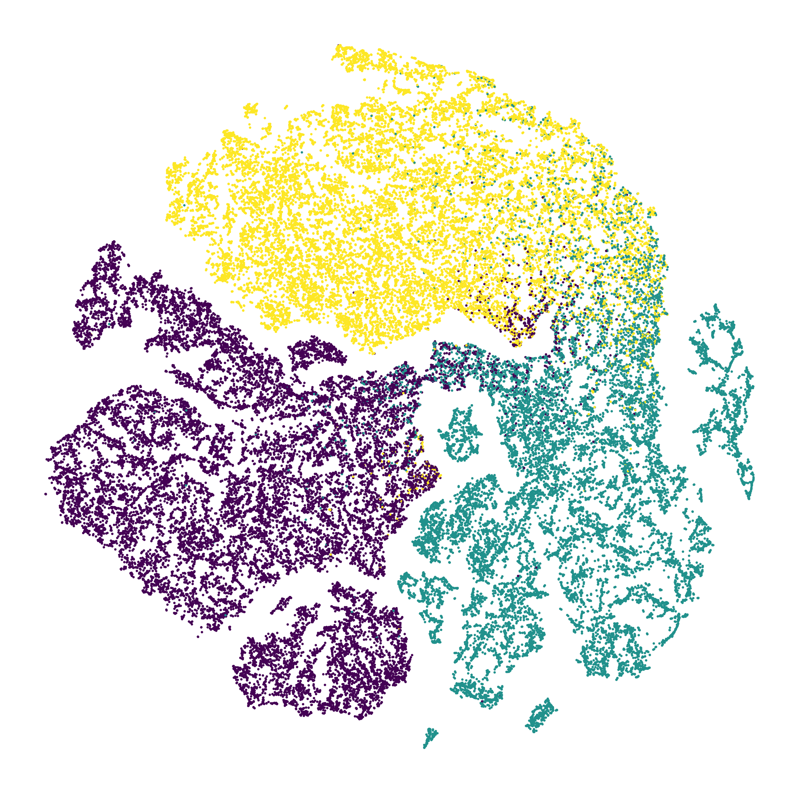

# CGAP: A Hybrid Contrastive and Graph-based Active Learning Pipeline to Detect Water and Sediment in Multispectral Images

This project provides all experimental details of our paper.

## Installation

To get started with this project, first, you need to install the necessary packages. You can do this by running the
following command in your terminal:

```bash
pip install -r requirements.txt
```

## Dataset Preparation

All our experiments are based on the [RiverPIXELS dataset](https://data.ess-dive.lbl.gov/view/doi:10.15485/1865732). The
dataset contents have been further processed into `.npy` files, which are available for download from
our [Shared Google Drive](https://drive.google.com/drive/folders/1yRSjhvQBxjYEHNXOVLc_MNjvZ66cGgHG?usp=sharing). Please
save your downloaded data in the `RiverPIXELS` folder.

## Pretrain the Feature Embedding Neural Network

The training process may take over 10 hours on a Nvidia 3070 LapTop GPU. You can skip this training process by using the
checkpoint `save/SupCon/SupCon.pth`.

Our code to train a feature embedding neural network via contrastive learning is based on
the [SupContrast Repository](https://github.com/HobbitLong/SupContrast/tree/master). As an example, the following
command is to train a network with the supervised contrastive learning approach:

```bash
python NetworkTrain.py --num_workers 2 --epochs 200 --batch_size 2048 --margin 4 --stepsize 1 --model cnn \
--method SupCon --temp 0.5 --learning_rate 0.02 --cosine --print_freq 60 --save_freq 25 \
--dataset_path RiverPIXELS/train_RiverPIXELS.npy --trial train_only
```

Here we use the training part `RiverPIXELS/train_RiverPIXELS.npy` rather than the whole dataset because it is
supervised. If you want to use `SimCLR` training, change `--method` to `SimCLR` and `--dataset_path`
to `RiverPIXELS/data_riverpixels.npy`. If you want to use the cloud augmentation, add `--cloud_augmentation`.

## Low-rank Visualization

To visualize the embedded features by UMAP and t-SNE:

```bash
python visualize_result.py --num_workers 4 --batch_size 2048 --margin 4 --model cnn --method Val --stepsize 8 \
--cp_load_path save/SupCon/SupCon.pth --TSNE
```

UMAP (left) and TSNE (right) visualization of the embedding feature vectors based on the
checkpoint `save/SupCon/SupCon.pth`:
<p float="left">
  
   
</p>

## Get Embedding Feature Vectors

To get the embedding feature vectors of the dataset `RiverPIXELS/train_RiverPIXELS.npy`:

```bash
python embedding_feature.py --num_workers 4 --batch_size 2048 --margin 4 --model cnn --method Val --stepsize 1 \
--cp_load_path save/SupCon/SupCon.pth --down_sample_rate None --dataset_path RiverPIXELS/train_RiverPIXELS.npy
```

The embedding feature vectors are saved into the file `RiverPIXELS/train_RiverPIXELS_ebd_features_.npy`

## Active Learning Selection

We use active learning to condense the processed feature vectors into a much small representative set (RepSet) from the
dataset of processed feature vectors. As an example, if you preprocess the dataset `RiverPIXELS/train_RiverPIXELS.npy`
into  
`RiverPIXELS/train_RiverPIXELS_ebd_features_.npy` according to the previous step. Then you can use the following command
to get the RepSet `RiverPIXELS/train_RepSet.npy`:

```bash
python ALSelection.py --eps_adjust_rate 5 --dataset_path RiverPIXELS/train_RiverPIXELS_ebd_features_.npy \
--save_path RiverPIXELS/train_RepSet.npy --acq_fun uc --use_prior
```

## Classification

To reproduce our results in the paper, please run:

```bash
python TestAndEvaluate.py --show_figures --train_dataset_path RiverPIXELS/Fix_features/AAL_features.npy \
--test_dataset_path RiverPIXELS/test_RiverPIXELS_ebd_features_.npy --ssl_method Stable_Laplace --ori_cmap 
```

You should use the command in *Get Embedding Feature Vectors* to preprocess the raw training and test datasets
`RiverPIXELS/train_RiverPIXELS.npy` and `RiverPIXELS/test_RiverPIXELS.npy` respectively. Then you should use the command
in *Active Learning Selection* to select a representative set (RepSet). Here you can simply use our prepared RepSet 
`RiverPIXELS/Fix_features/AAL_features.npy`.

## Apply Our Approach to ANY LandSat Image
Please check our GitHub repository of [GraphRiverClassifier]([https://github.com/wispcarey/GlobalRiverPIXELS](https://github.com/wispcarey/GraphRiverClassifier)).

## License
MIT License

Copyright (c) 2024 Bohan Chen

Permission is hereby granted, free of charge, to any person obtaining a copy
of this software and associated documentation files (the "Software"), to deal
in the Software without restriction, including without limitation the rights
to use, copy, modify, merge, publish, distribute, sublicense, and/or sell
copies of the Software, and to permit persons to whom the Software is
furnished to do so, subject to the following conditions:

The above copyright notice and this permission notice shall be included in all
copies or substantial portions of the Software.

THE SOFTWARE IS PROVIDED "AS IS", WITHOUT WARRANTY OF ANY KIND, EXPRESS OR
IMPLIED, INCLUDING BUT NOT LIMITED TO THE WARRANTIES OF MERCHANTABILITY,
FITNESS FOR A PARTICULAR PURPOSE AND NONINFRINGEMENT. IN NO EVENT SHALL THE
AUTHORS OR COPYRIGHT HOLDERS BE LIABLE FOR ANY CLAIM, DAMAGES OR OTHER
LIABILITY, WHETHER IN AN ACTION OF CONTRACT, TORT OR OTHERWISE, ARISING FROM,
OUT OF OR IN CONNECTION WITH THE SOFTWARE OR THE USE OR OTHER DEALINGS IN THE
SOFTWARE.


